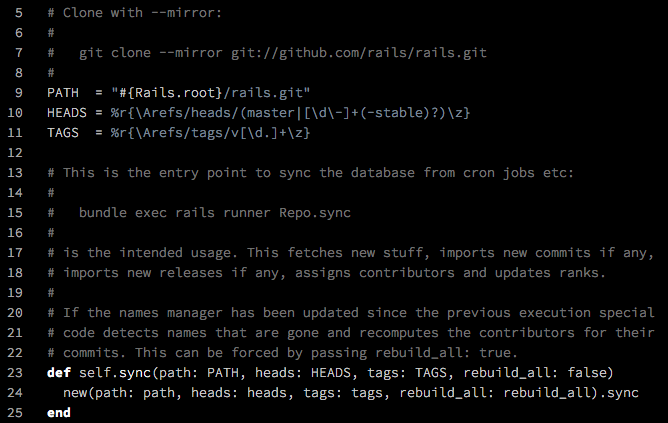

## monochrome - A dark Vim color scheme for your focused hacking sessions

### Installation

Installation depends on how you manage packages. For example, with
[vim-plug](https://github.com/junegunn/vim-plug) add

```
Plug 'fxn/vim-monochrome'
```

to your init file.

### Configuration

This color scheme works in GUIs and 256 color terminals, throw this to your
_~/.vimrc_:

    colorscheme monochrome

Comments can optionally be rendered using italics:

    let g:monochrome_italic_comments = 1
    colorscheme monochrome

It is important that the flag is set before loading the theme.

### Screenshots

Monochrome looks like this by default:



This capture show italics enabled for comments, and a transparent setup with a
dark wooden background:


