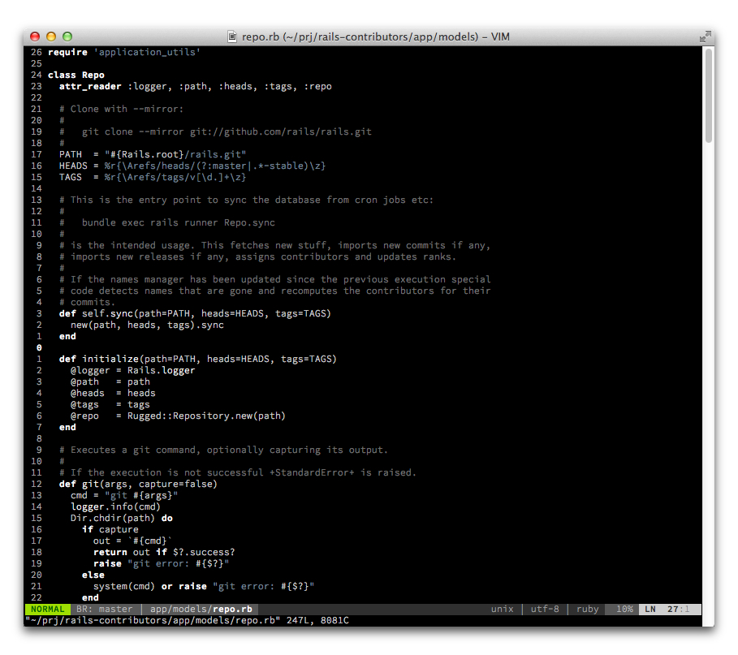
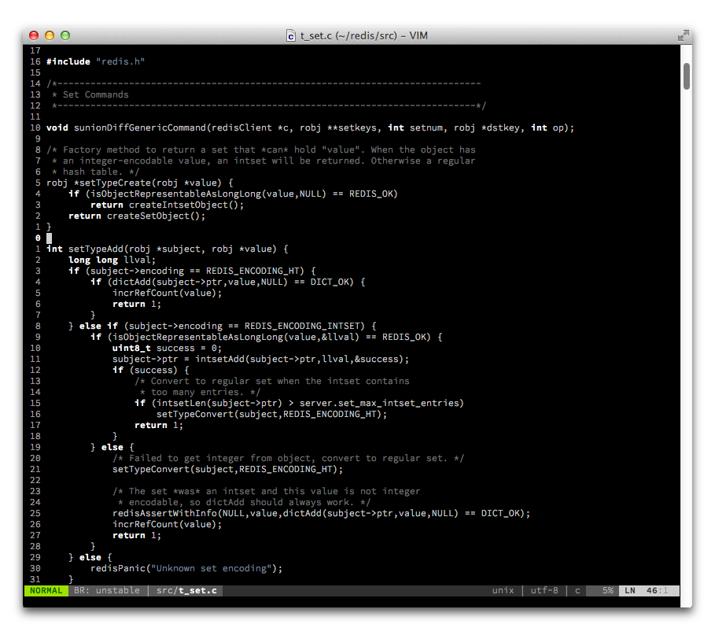
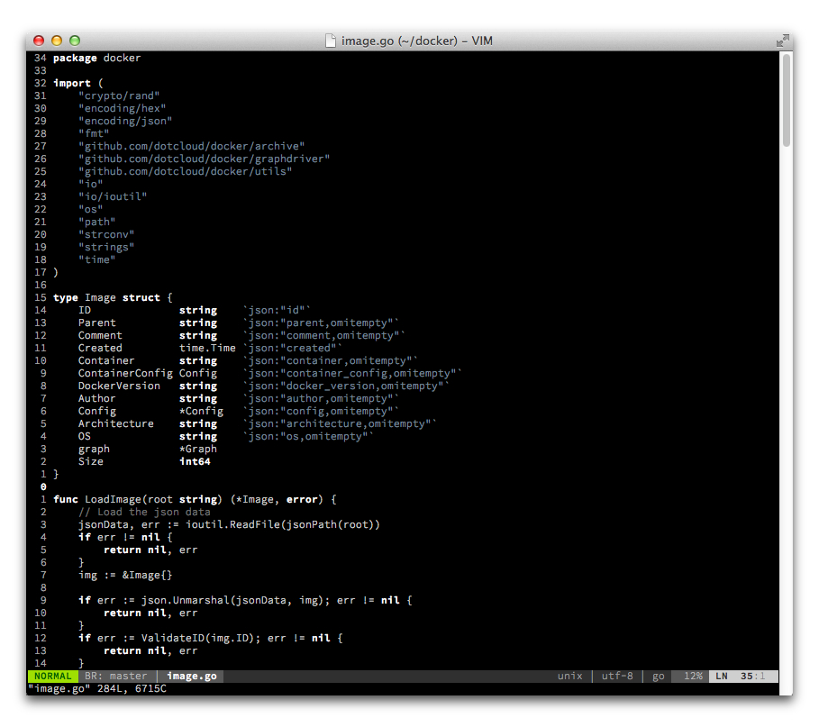
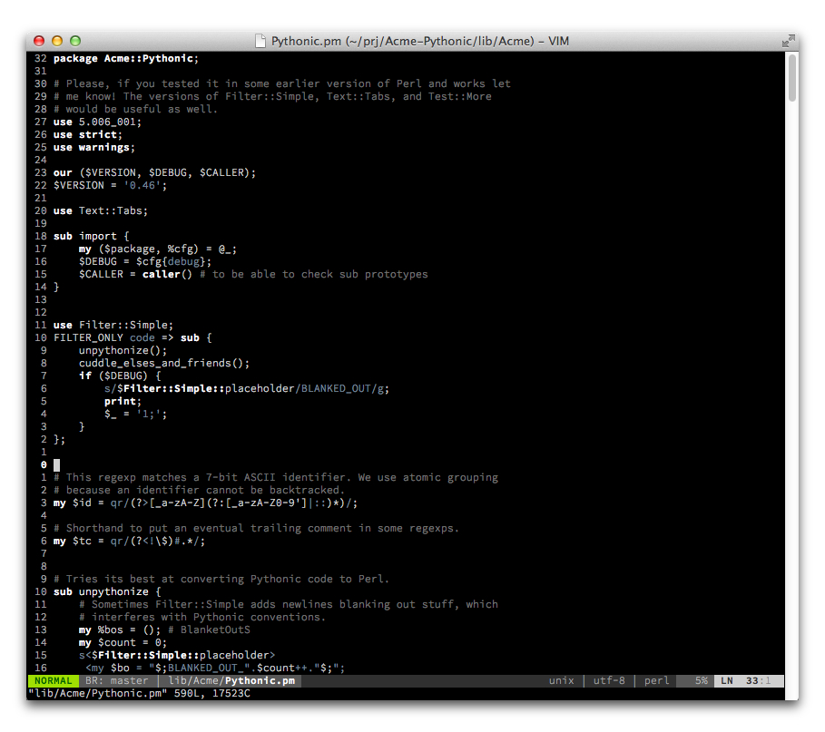
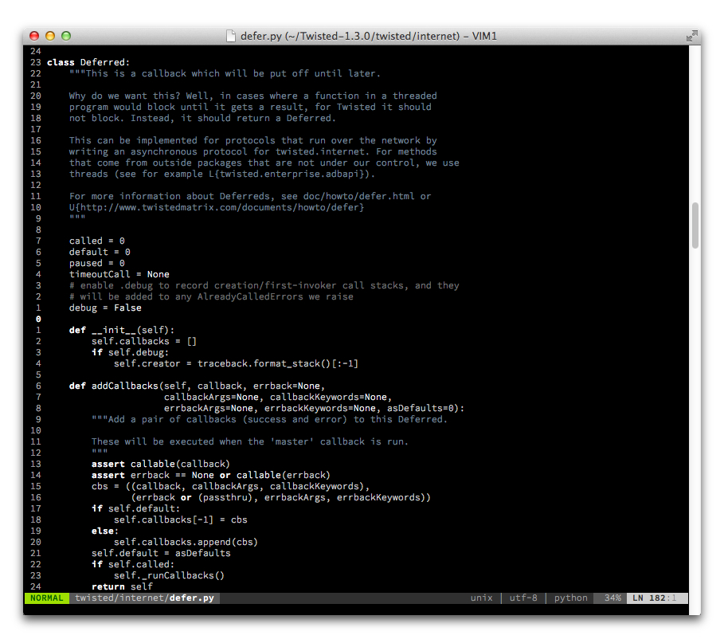
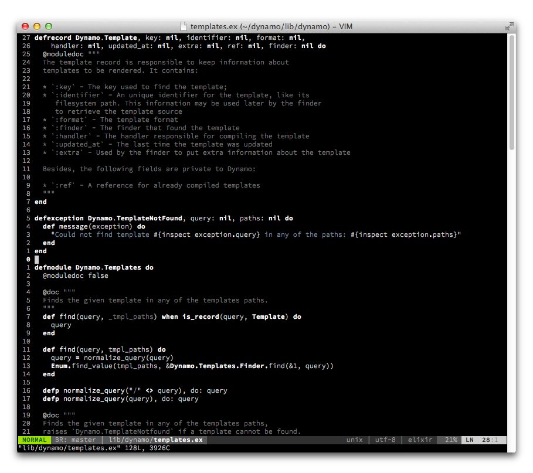

## monochrome - A dark Vim color scheme for your focused hacking sessions

### Installation

Installation depends on how you manage packages. For example, with
[vim-plug](https://github.com/junegunn/vim-plug) add

```
Plug 'fxn/vim-monochrome'
```

to your init file.

### Configuration

This color scheme works in GUIs and 256 color terminals, throw this to your
_~/.vimrc_:

    syntax on
    colorscheme monochrome

### Screenshots

#### Ruby



#### C



#### Go



#### Perl



#### Python



#### Elixir



#### JavaScript


